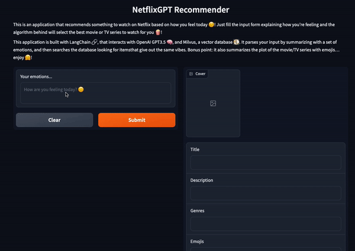
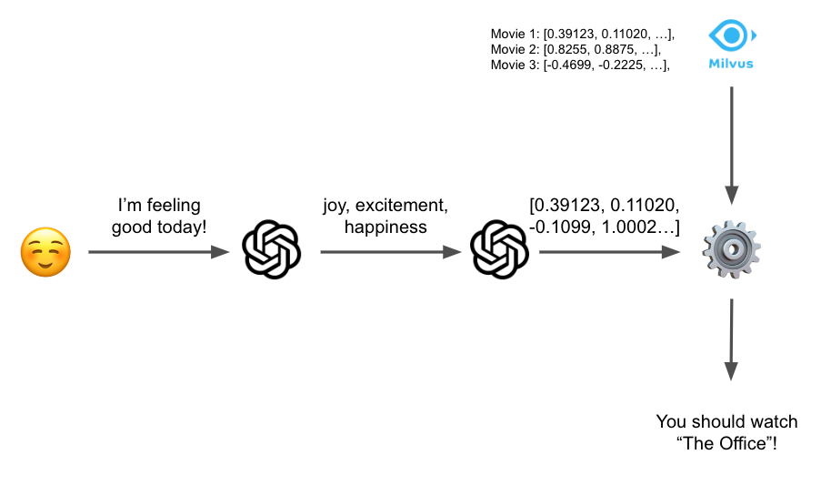

# NetflixGPT 🍿

This project implements a simple Recommender System for something 
to watch on Netflix based on your mood!
You are asked to describe how you're feeling today and it
will recommend something to watch that gives out the same vibes.



It's implemented with:

* LangChain, a library to interact with LLMs
* OpenAI's GPT 3.5
* OpenAI's text-search-ada-doc-001, for text embeddings
* Milvus, a vector database
* Gradio, a library to create simple interfaces

You can watch a short demo of how it works [here](https://www.youtube.com/watch?v=atAGttjqpQg&feature=youtu.be).

## Data collection

I started by Kaggle's Dataset [Netflix TV Shows and Movies](https://www.kaggle.com/datasets/victorsoeiro/netflix-tv-shows-and-movies).
This dataset (which I sampled 2k datapoints from) contains information on a range of Netflix items,
including their **title**, **genres** and **description**.

I extrapolated a list of emotions for each item, using LangChain and GPT3.5, with 
the following prompt:

```
I'll send the title of a Netflix item, along with its summary and genres.

Title: {title}
Summary: {summary}
Genres: {genres}

Produce a list of 8 emotions that you think this item would make the watcher feel.
Additionally, I want you to describe the movie plot with some emojis.
Provide a list of comma separated values.

Sample output:

emotions: [adventure, excitement, heroism, wonder]
emojis: 🧞‍☠️🚪
```

Bonus point: I also asked GPT to extrapolate a list of emojis that could describe
the plot of the item.

In order to re-run the data collection part, you can launch:

```python generate_emotions.py```

## Embeddings & Vector Databases

Now, I needed all the data to be stored in a database.
However, my use case requires my data to be **embedded**, **stored** and **queried**.

For this use-case, I embedded the data by using OpenAI's ```text-search-ada-doc-001```.
In particular, I only embedded the emotions associated to each item by GPT.
To store the data I used [Milvus](https://milvus.io/) as a vector database, that allows you to run embeddings
queries easily.
For each item, I store the embedding of each emotion, along with its metadata (title, description, genres).


Milvus is an open-source vector database that enables fast and efficient similarity search
for high-dimensional vectors. By sending a query vector, Milvus can quickly retrieve 
the most similar vectors from the database based on distance metrics
like Euclidean distance or cosine similarity. 
This makes Milvus an ideal choice for applications that require real-time 
similarity matching, such as recommendation systems and content-based search.

## How it works

The user is asked to fill a form describing how he/she feels today.
The user's input is not embedded as it is. Instead, it is sent to GPT3.5, along with the following prompt:

```
I will send you a description of how I'm feeling, you should respond with a comma-separated list of emotions.

Examples:

Input: "That was such a great day!"
Output: emotions: [happiness, excitement, joy]

Input: "I'm so pissed off"
Output: emotions: [anger, discomfort, irritation]

Answer with a list of emotions from 1 to 8 for the following input:

{user_input}
```

We then use the GPT's response to run a query against our vector database, so that
embeddings of emotions are compared between each other.



## How to run

All you need is:

* python 3.9 or above
* poetry
* docker

First of all, you should have a Milvus instance up and running, but you can do it easily
with:

```
docker-compose up -d
```

Also, you'll need an OPENAI_API_KEY:

```
export OPENAI_API_KEY=<OPENAI_API_KEY>
```

Then you just start a new poetry environment with:

```
poetry install
```

and launch the app with:

```
python app.py
```

Have fun!


